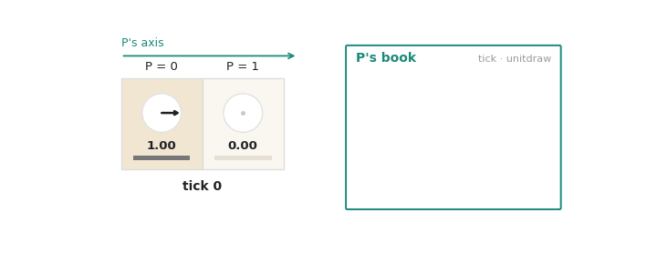
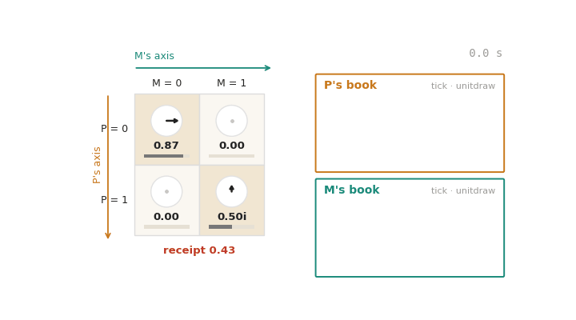
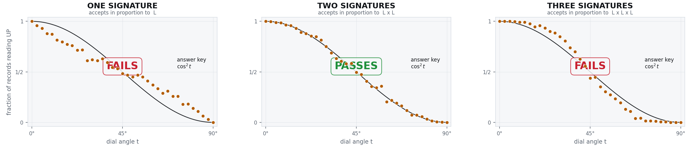

# Two to Sign Is the Norm

*Quest for Entropy #17: the proofs say quantum probability must be a square, never how. On the ledger a fact needs two signatures, and two lengths make an area. That is the Born rule.*

## The question

Last episode ended with a promise: the universe that has to grow. That episode is still coming, but the plan changed. While preparing it I found something in the wave mechanics itself, and it will take a few episodes to bring in. This is the first.

Last episode the wave arithmetic was imported. We put it behind a socket, plugged in the standard libraries, and showed what the ledger adds on top: no signalling, no order, no path. We are now working on the wave arithmetic itself. For these episodes the imported math stays, because it keeps the concepts simple, but I hope to bring in more of the wave mechanics in the episodes to come.

For simplicity, this episode does not derive the wave. The socket stays. But it opens one door inside it, the one I had been staring at for months: the moment a wave stops being a wave and becomes an answer. Physics calls it measurement, or collapse, and writes down a rule for the odds. The rule is famous, short, and strange. Every possible outcome carries a complex number, the amplitude. The probability of the outcome is the amplitude's length, squared.

*Squared*. Max Born wrote the rule down in 1926 and, the story goes, the square arrived in a footnote. It has never left. Every quantum computer is programmed against it and every interference pattern obeys it. Textbooks postulate it. Mathematicians have done better than that: Gleason proved in 1957 that once you accept the rest of the quantum machinery, the probabilities have to be the squares and nothing else, and several later derivations reach the same place from other starting points. But all of them prove that it must be so, not how it comes to be so. They tell you the square is forced. They do not tell you what does the squaring. If nature keeps a number for each outcome and bets on it, a length is the natural thing to bet on. A square is an area. What is the second side?

That question has a plain answer on the ledger, and the answer is in the title. A fact is never written once. It needs two parties to agree, and so two signatures, one in each of two books. Each book signs in proportion to a length: the length of an amplitude in the table the two parties share, which is the wave. The norm. Two lengths make an area. This episode builds the smallest machine in which that is literally what happens, runs it, and shows where it lands on the quantum curve and where it does not.

## The toy

The quantum machinery is not easy to hold in the head, so I use everyday words for it, the words of a ledger. For readers with a physics background, where a word has a name in the physics I give that name once in brackets and then drop it. A few words have no physics name, because the thing they name is new here, and I say so when that happens.

The state of a wave at one moment is a **table** [state vector]. A wave carrying one particle that can settle to 0 or 1 has a table with one **axis** and two **cells**, and each cell holds an **arrow** [amplitude]: a complex number, a length and a direction. A wave carrying two particles that have met has two axes and four cells, one per combination. The number of axes is the number of particles: one particle two cells, two particles four, three particles eight, doubling with every particle that joins. That doubling is the whole horror of the wave function from last episode, drawn as a spreadsheet.

Two values per particle is the smallest case and the only one this episode uses. A particle with more places to settle has more cells on its axis, and everything below runs unchanged.

Each particle is a **thread** [one particle; here, one qubit], because that is what it is in the code: it owns one axis of the table, it acts on the table along that axis only, and it keeps its own **book**, an append-only record of what it did at every **tick** of its own clock. Measurement is touching, last episode's rule, so a detector is a thread like any other. This episode needs two: the particle P and its detector M. Once they share a table, P's axis runs down and M's runs across.

This is one particle, left alone. It is P, but any particle looks the same; the detector M that comes later is a thread exactly like this one, only its dial, its phase and its clock may differ. A tick is one beat of P's own clock, and at every tick P does two things.

First, it applies its **turn** [unitary evolution] to its table: the pair of cells along its axis is rotated by P's **dial**, a fixed angle. The angle adds up tick by tick, so the arrows go round. Nothing random, nothing written, nothing lost. A turn never creates or destroys length, it only moves length between the cells, and every turn has an exact opposite that undoes it. The rule itself is four numbers, and it is written out on the appendix page.

Second, it appends one record to its book. Each record carries a number between 0 and 1, its **unitdraw**, and each unitdraw is the hash of the record before it, so a book is a hash chain, the way a blockchain is. Nobody chooses these numbers. They are simply there, one per record, and they are what the settlement will read. So the turn is what a tick does to the table, and the record is what it leaves in the book.

A lone particle does nothing but this. It ticks. Nothing is written, nothing is decided, and all of it can be run backwards. For anything to be decided, something has to touch it.

### The meeting

When two particles meet, they become entangled. Their two tables become one joint table, one axis each, and from then on both keep ticking on their own clocks, each turning the joint table along its own axis only: P turns the pairs in a column, M turns the pairs in a row, and it never matters which ticks first. The meeting itself, the move that joins the two tables, is standard quantum arithmetic [a CNOT gate], and you can make it one button at a time on [the table bench](https://questforentropy.com/demo/the-table-bench).

The red number under the table is the **receipt** [an entanglement measure; half the concurrence]. It is one number computed from the four cells. It is zero when the table is still P's strip times M's strip, and not zero when the two are entangled, when nobody can say what P holds without saying what M holds. Watch it in the animation: the cells change at every tick and the receipt never moves. No turn by either particle can change it, because each turns only along its own axis. That is what entangled means on a table.

One more word before the settlement. The **length** of a cell is the length of its arrow [the modulus of the amplitude]. Why care about it? Because at a settlement one of the four cells has to win, and the length of a cell's arrow is going to be its share in that lottery. The plain length, not the square. Hold on to that; it is the whole trick.

During the meeting nothing has been written. The meeting is as reversible as the turn; all that is different is that the two threads now have one table between them instead of two. But some meetings end with something written for good, and that is a **settlement**. What makes one meeting settle and another not is the next episode's subject. For this episode I take it for granted that a settlement has started, and ask how the Born rule comes out of it.

### The settlement

Now the mechanism, and it fits in one sentence: **the arrows fix the sizes, each of the two particles reads its own unitdraw, and an outcome becomes a fact only if both unitdraws, independently, pick the same one.** Slowly, in five steps.

**One, the lines.** A settlement is between the two threads that met: the particle and its detector, the two parties to the transaction. Their table has four cells, and I will call them **lines** [joint outcomes], because each names both parties: "P reads 0 and M reads 0", and so on. Each line has a length, and the length is its share.

**Two, the unitdraws.** Every record a book appends carries its unitdraw, the number between 0 and 1 from the first animation. It goes in when the record does, it never changes afterwards, and nobody chooses it. How it is made does not matter much — in the toy it is the hash of the previous one — so long as it is fair and one book's unitdraws tell you nothing about the other's. There are no dice anywhere in this machine, and nothing is invented for the settlement: every thread already had unitdraws, because every thread already had a book.

**Three, the ruler.** Lay the four lengths end to end and shrink the strip to length one, so that every line owns a stretch in proportion to its length. That strip is the **ruler** [in statistics, the quantile function], and a unitdraw is a point on it. Notice what goes on the ruler and what does not. Lengths go on it, not squares. The arrows' directions do not go on it at all: they did their work earlier, deciding which contributions add and which cancel, and by the settlement they are spent.

**Four, the signatures.** Each book drops its newest record's unitdraw onto the ruler as a needle and signs for the line the needle lands in. So a book signs for a line in proportion to that line's length. It sees two things, the lengths and its own unitdraw, and it never sees the other book's needle.

**Five, agree or repeat.** If the two **signatures** name the same line, that line is a **fact**: it is posted in both books, and the table is **narrowed** [projected; this is the collapse], the other three cells set to zero so that only the posted line is left. If they name different lines, that is a **refusal**: nothing is posted, the table is untouched, and both threads sign again at the next tick with fresh unitdraws. The loop runs until they agree, and they always do, eventually.

That is all of it. Two independent bets on an outcome that have to match. The double entry of accounting: an entry is not an entry until it appears in both books, and a half-posted transaction does not exist.

And that is where the square comes from. A line with some share of the ruler gets P's signature that often, and gets M's signature that often, independently. Both at once is length times length. Nothing squared anything. The ruler carried lengths. Each book compared one length against one needle of its own. The squaring lives entirely in the demand that two needles land in the same stretch.

But wait, why two? Why not one, or three, or four? Let me think it through.

### Why two

The unitdraws are already there, one per book, so "how many books sign a fact" is really the question of how many independent signatures a fact needs. Take the cases in order.

**A particle alone** never settles. It ticks, and that is all. There is no second book. A settlement is a transaction, and a transaction with one party is not a transaction. This case is ruled out by structure, before any counting happens.

**One signature.** Two particles meet, and the simplest rule you could write is that one of them decides alone: it drops its own unitdraw on the ruler, and the line it lands in is the fact. There is nothing to disagree about, so every tick posts. Voilà, all good. Except one thing: the counted odds do not follow the Born rule. A line is posted as often as its plain length, and the quantum answer is the square. Which makes sense, because nothing in this rule ever multiplies two lengths.

**Two signatures.** Both drop their needles, and they repeat until they agree. Now a line has to win twice, and the counted odds sit on the quantum curve, at every dial angle.

**Three signatures.** Take Bell's setup: two particles entangled earlier and flown apart, and now one of them meets a detector. The two that touch share their table with the third, eight cells in all, and the third has a book and unitdraws of its own. What if it signs too? We counted that as well, and it fails the Born rule the other way. A line now has to win three times, and three lengths make a cube, not a square. The third particle is genuinely entangled and genuinely present, and it still must not sign.

The picture says the count in one line. With one signature the counted curve runs flatter than the quantum key; with three it runs steeper; with two it sits on it. The number of signatures is the exponent. Two is the square, and two is what nature does. So that is the postulate this episode makes: a measurement is an interaction between two particles, each picking an outcome independently, and the outcome has to be agreed.

## The run

The whole machine is one small file, and it sits three exams: the Born ladder above, a Bell exam, in which the table after a meeting reaches the quantum value that no product table can, and a third exam in which a detector meets one particle of an entangled pair and the odds of the other particle do not move at all. What moves is whom it agrees with. Every step of this page, with the numbers, the worked tables and the three exams, is on the appendix page: https://questforentropy.com/p/two-to-sign-is-the-norm/mechanism.

## The Confession

Every episode confesses. This one has four items.

**The two is found, not imported, and not yet proven.** The table and its turns came from the textbooks. The two did not: I did not put two signatures in because physics said so, the count picked two out, and one and three fail on every table we tried. That the number nature needs is also the number of parties in every interaction we know of, a particle and whatever it hits, including the detector particle it hits first, is what makes me take it seriously. But it is still a postulate. The toy shows a mechanism that fits; it does not show that nature runs this mechanism, and a fit is not a proof.

**Which meeting settles is not in this episode.** Two particles that meet and fly apart share an entangled table and do not settle; a particle that meets a detector does. The mechanism above tells you the odds once a settlement happens. It does not tell you what makes a detector different from a partner particle, and it holds the table still while the books sign. Nor does it say why a detector made of a great many particles signs once rather than many times; the toy's answer, that the rest of the detector copies the record instead of signing it, is the next episode's to earn. That difference, and what "irreversible" means for a ledger where nothing is ever deleted, is where the quantum eraser and the delayed choice live.

**The unitdraws are hashes, and the mechanism needs them fair.** No dice anywhere; every unitdraw is the hash of the one before it. I tried the cheaper option of letting the two lines simply take turns being tried, and it fails: the line tried first gets an edge and the curve is wrong. A fresh independent signature every tick is what makes the odds forget the past. Any fair stream works, true randomness included; a biased one does not.

**The table is still imported.** The arrows, the turn, the meeting: that is standard quantum arithmetic written as a spreadsheet, and this episode uses it, it does not explain it. What is new here is only the last step, the settlement, replacing "probability equals amplitude squared" with "two books sign in proportion to length". The machine that produces the arrows themselves from counting, with no complex numbers put in by hand, is a later episode.

## What this does NOT claim

> This episode shows that a settlement rule in which two independent books each sign for an outcome in proportion to its amplitude length, and a fact needs both signatures on the same outcome, reproduces the Born rule, while one signature or three do not. The same rule leaves a distant partner's odds untouched and passes the Bell exam; the numbers are on the appendix page. It does **not** derive the wave: the table and its turns are standard quantum arithmetic, imported. It does not prove that nature settles this way; the two is picked out by counting, and that nature runs the same mechanism is the postulate. It does not say when a settlement occurs, or why a detector settles and a partner particle does not. It is not a claim that nature keeps books, runs a loop, or hashes records; it is a claim that a small deterministic machine with those parts passes these exams, and the code is public so that you can break it.

## The neighbors

The rule itself is Born's, 1926. The best-known result about why the square is Gleason's theorem of 1957: in three or more dimensions, any assignment of probabilities that adds to one on every orthogonal decomposition must be the square of the amplitude. Our balance argument, on the appendix page, is Gleason's poor cousin, run on a counting machine instead of a Hilbert space, and it should be read that way; what the machine adds is not the theorem but a mechanism that satisfies it. Masanes, Galley and Müller showed in 2019 that the measurement postulates follow from the rest of quantum theory, another proof of must rather than how. Zurek derived the Born rule from the symmetries of entangled pairs, under the name envariance; Deutsch and Wallace derived it from decision theory inside the Everett picture; both start from the wave and end at the square, as we do, from a different door. Scott Aaronson has a lecture arguing that the 2-norm is the only norm a nontrivial linear theory can conserve, which is our "a turn never creates or destroys length" in a mathematician's voice. The closest cousin to two signatures is Cramer's transactional interpretation from 1986, where a measurement is a handshake between an offer wave and a confirmation wave, and the square is the product of the two. And the oldest neighbor is not a physicist: Luca Pacioli set down double-entry bookkeeping in 1494, and the rule that no entry exists until it is posted in two books is his.

## The postulate

Stripped of books and ledgers, in the language physics already uses, the claim this toy points at is one paragraph long:

> Every measurement is an interaction between two particles, and it does not matter which of them we call the observer. Each selects an outcome in proportion to the amplitude, independently of the other, and only an outcome both select is recorded. The chance of two independent selections agreeing is amplitude times amplitude.

## Run it yourself

The whole machine is one file, numpy only, and it runs the three exams in a couple of minutes: [github.com/masteris777/quest-for-entropy-two-to-sign-is-the-norm](https://github.com/masteris777/quest-for-entropy-two-to-sign-is-the-norm), one command: `python run_all.py`. The animations are in the same repository. And every move above can be made one button at a time, with the arithmetic written out as it happens, on [the table bench](https://questforentropy.com/demo/the-table-bench).

## How this was made

I'm a software architect. I built an adversarial research harness around AI agents and ran a physics toy-model programme through it; this piece reports a part that survived. The direction, the concepts, the questions and the accept/reject calls are mine; AI systems (Anthropic's Claude Fable, Opus and Sonnet, plus DeepSeek) executed the experiments from frozen, pre-declared specifications and wrote the text, this article included, from my guidance and under my editing. Every number is code-generated and reproducible from the repository above. A public honesty ledger records every commissioning error the process caught.

## Next time

Nothing in this episode's ledger is ever deleted, so what does "irreversible" even mean? Next time: the late choice. The quantum eraser is not a miracle but the normal state of an uncommitted line, and a choice made after the fact turns out to be a choice about something else.

---

*Quest for Entropy is written by Marijus Masteika. Entropy was always the dark horse for me — connected to information, and maybe hiding answers to everything. That's the quest.*
