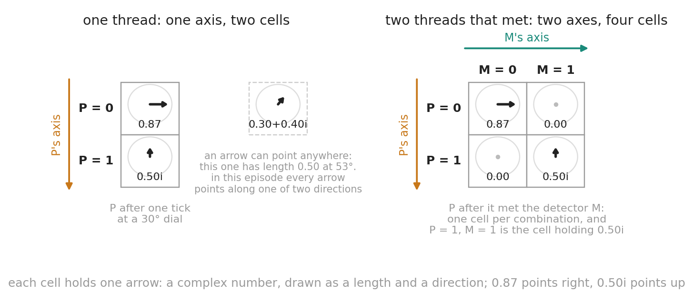
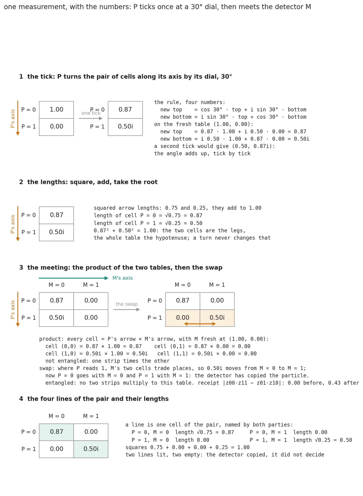
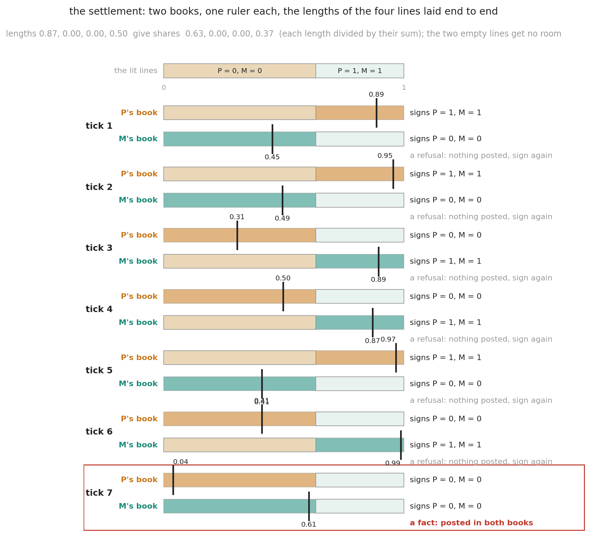
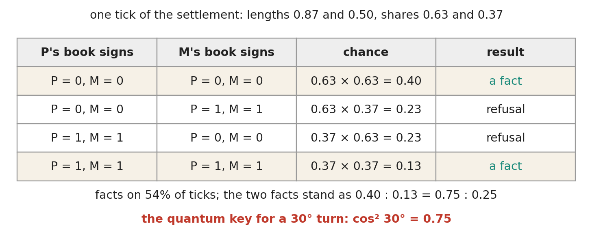
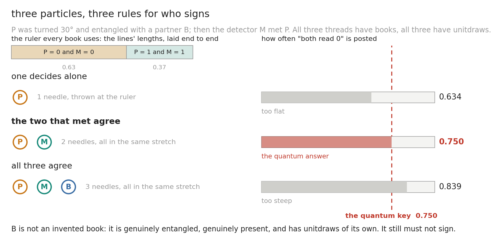
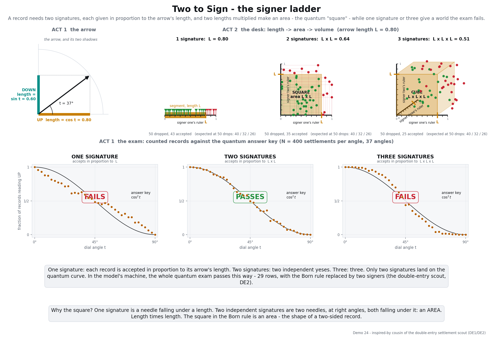
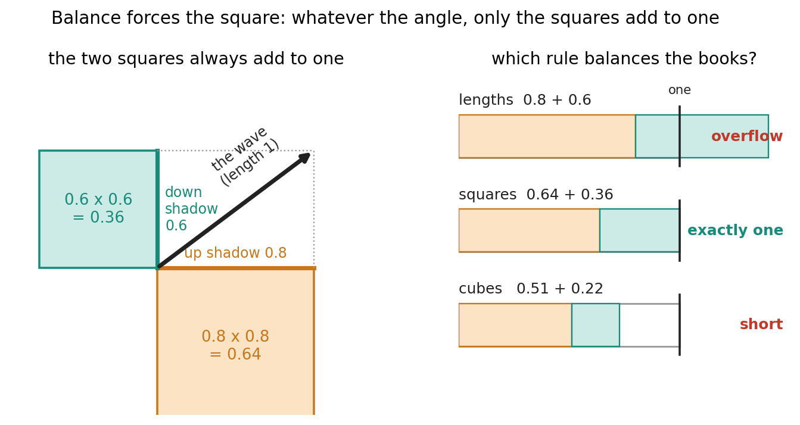
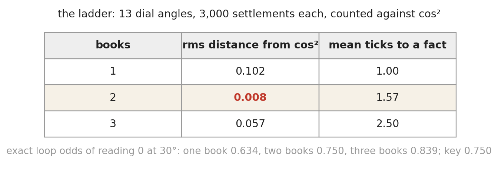

# Two to Sign Is the Norm - the mechanism

*Appendix to Quest for Entropy #17. The article explains what is going on; this page walks through the toy one move at a time, with the numbers. Every move can also be made by hand on the table bench: https://questforentropy.com/demo/the-table-bench.*

## The toy

Everything below uses a handful of words, and I will keep to them. Where a word has a name in the physics, I give that name once in brackets and then drop it.

### The table

The state of a wave at one moment is a **table** [state vector]. A wave carrying one particle that can settle to 0 or 1 has a table with one **axis** and two **cells**, and each cell holds an **arrow** [amplitude]: a complex number, a length and a direction. A wave carrying two particles that have met has two axes and four cells, one per combination. The number of axes is the number of particles: one particle two cells, two particles four, three particles eight, doubling with every particle that joins. That doubling is the whole horror of the wave function from last episode, drawn as a spreadsheet.

Two values per particle is the smallest case and the only one this episode uses. A particle with more places to settle has more cells on its axis, and everything below runs unchanged.

Each particle is a **thread** [one qubit], because that is what it is in the code: it owns one axis of the table, it acts on the table along that axis only, and it keeps its own **book**, an append-only record of what it did at every **tick** of its own clock. Measurement is touching, last episode's rule, so a detector is a thread like any other. This episode needs two: the particle P and its detector M. In every picture P's axis runs down and M's runs across.



The **length** of any part of the table is its share: take the cells in question, add up the squares of their arrow lengths, divide by the same sum over the whole table, and take the square root. Cut a table into pieces and the pieces' lengths are the legs of a right triangle whose hypotenuse is the whole table, so their squares add to one. Hold on to that; it is Pythagoras, and it is going to do the work.

### The turn

Take P alone, fresh: 1.00 in the cell P = 0 and nothing in P = 1. At each tick P applies its **turn** [unitary evolution] to its table: the pair of cells along its axis is rotated by P's **dial**, a fixed angle, and the rule is four numbers. The new top cell is cos θ times the old top plus i sin θ times the old bottom; the new bottom cell is i sin θ times the old top plus cos θ times the old bottom. One tick at a 30-degree dial turns (1.00, 0.00) into (0.87, 0.50i). A second tick would give (0.50, 0.87i): the angle adds up, tick by tick. Nothing random, nothing written, and nothing lost. A turn never creates or destroys total length, 0.87 squared plus 0.50 squared is still 1, it only moves length between the cells, and every turn has an exact opposite that undoes it. Here is all of it with the numbers, computed by the code:



A lone particle does nothing but this. It ticks. Nothing is written, nothing is decided, and all of it can be run backwards. For anything to be decided, something has to touch it.

### The meeting

After one tick P meets the detector M, a fresh thread at (1.00, 0.00). Their two tables are written as one, cell by cell as a **product** [tensor product]: every cell is P's arrow times M's arrow, so P's two arrows sit in the column M = 0 and the column M = 1 is empty. Then one **swap** [a CNOT gate] is applied: where P reads 1, M's two cells trade places, and the 0.50i moves from M = 0 to M = 1.

```
    the product                       after the swap
    [ 0.87    0     ]                 [ 0.87    0     ]
    [ 0.50i   0     ]                 [ 0       0.50i ]
```

Now P = 0 goes with M = 0 and P = 1 with M = 1. The detector has copied the particle, and the table is **entangled**: no strip for one thread times a strip for the other can produce it. The **receipt**, the number that tests it, is the four cells multiplied crosswise and subtracted, the cell where both read 0 times the cell where both read 1, minus the two crossed cells; it is 0 before the swap and 0.43 after, and no turn by either thread can change it. The swap is the only move that touches two axes at once. Once two threads share a table each still turns only along its own axis, P the pairs in a column and M the pairs in a row, and it never matters which ticks first. This episode turns nothing after the meeting; the next one does.

And still nothing has been written. The meeting is as reversible as the turn; apply the swap a second time and the table comes apart again. All that is different is that the two threads now have one table between them instead of two.

So two different things can happen when particles touch, and this episode keeps them apart. A **meeting** puts two threads on one table, writes nothing, and can be undone. A **settlement** writes a fact and cannot be undone. In the machine behind these episodes they are the same event seen at two scales — a settlement is a meeting whose other lines have spread beyond reach — and that is the next episode's subject. Here they are two separate moves, and the toy is told which one to make.

### The settlement

Now the mechanism, and it fits in one sentence: **the arrows fix the sizes, each of the two threads picks a value by its own clock, and a value becomes a fact only if both clocks picked the same one.** Slowly, in five steps.

**One, the lines.** A settlement is between the two threads that met: the particle and its detector, the two parties to the transaction. Their table has four cells, and I will call them **lines** [joint outcomes], because each names both parties: "P reads 0 and M reads 0", and so on. Each line has a length.

After a clean meeting only two of the four lines are **lit**. The detector copied the particle, so "P reads 0 while M reads 1" cannot happen, and those two lines hold zero. The lit lines are P = 0 with M = 0 at 0.87, and P = 1 with M = 1 at 0.50.

**Two, the ruler.** Lay the four lengths end to end and divide by their total, so that the strip runs from 0 to 1. Each line now owns a stretch in proportion to its length. That strip is the **ruler**, and each book gets its own copy of it:

```
    |<------------- 0.63 ------------->|<------- 0.37 ------->|
    0          P = 0 and M = 0               P = 1 and M = 1   1
```

Notice what goes on the ruler and what does not. Lengths go on it, not squares. The arrows' directions do not go on it at all: they did their work earlier, deciding which contributions add and which cancel, and by the settlement they are spent. And the two dead lines take no room, which is why this ruler has two stretches and not four.

**Three, the unitdraws.** Every record a book appends carries one number between 0 and 1: its **unitdraw**. It goes in when the record does, it never changes afterwards, and nobody chooses it. How it is made does not matter much — in the toy each book is a hash chain, every unitdraw the hash of the one before it — so long as it is fair and one book's unitdraws tell you nothing about the other's. There are no dice anywhere in this machine, and no clock is invented for the settlement: every thread already had unitdraws, because every thread already had a book.

**Four, the signatures.** Each book drops its newest record's unitdraw onto its ruler as a needle and signs for the line the needle lands in. So a book signs for a line in proportion to that line's length. It sees two things, the lengths and its own unitdraw, and it never sees the other book's needle.

**Five, agree or repeat.** If the two **signatures** name the same line, that line is a **fact**: it is posted in both books, and the table is **narrowed**, the other three cells set to zero so that only the posted line is left. If they name different lines, that is a **refusal**: nothing is posted, the table is untouched, and both threads sign again at the next tick with fresh unitdraws. The loop runs until they agree.

That is all of it. Two independent bets on length that have to match. The double entry of accounting: an entry is not an entry until it appears in both books, and a half-posted transaction does not exist.

Here it is on our table, with the toy's own unitdraws.



For six ticks P's needle lands in one line and M's in the other: six refusals, nothing posted. At the seventh both land in "P = 0, M = 0", that line is posted in both books, the table is narrowed to it, and the receipt drops to 0. This run happened to be a long one; on average a fact takes fewer than two ticks. Now count the four things that can happen at a tick:



Facts happen on 54 percent of ticks, refusals on the rest, and the loop always ends. And here is the point of the entire episode. On the ruler, the line "P = 1 and M = 1" owned 0.37, its plain length as a share of the strip. Run the settlement a few thousand times and that line is posted 0.25 of the time, which is 0.50 squared, its length squared. The other line owned 0.63 and is posted 0.75 of the time, which is 0.87 squared, and which is also cos squared of 30 degrees, the quantum answer for this dial.

Nothing squared anything. The ruler carried lengths. Each book compared one length against one needle of its own. The squaring lives entirely in the demand that two needles land in the same stretch.

Here is the settlement in the code, without the bookkeeping around it:

```python
def settle(self, p, m, books=2):
    L = self.lengths((p, m)).ravel()          # the four lines' lengths
    cum = np.cumsum(L / L.sum())              # the ruler: laid end to end
    while True:
        signatures = [np.searchsorted(cum, unitdraw(book)) for book in books_of(p, m)]
        if len(set(signatures)) == 1:         # the same line in every book: a fact
            break                             # otherwise a refusal: sign again next tick
    self.narrow_to(signatures[0])
```

One case is worth keeping in your hand, because it is the simplest one there is. Do not tick P at all. It stays definite at (1.00, 0.00); the meeting gives a table with a single lit line of length 1.00; the ruler is one stretch covering the whole strip; both needles land in it whatever they read; and the fact is posted at the first tick, with no refusal ever, and no receipt, because nothing was entangled. Which is as it should be. The particle was already decided, and the measurement only confirms it.

You can run every move above, one button at a time, on the bench: [the table bench](https://questforentropy.com/demo/the-table-bench).

### Why two

The clocks are already there, one per book, so the question "how many books sign a fact" is really a question about who is in the room. Take the cases in order.

**One particle.** It ticks, and that is all. There is no settlement — not because one signature would give the wrong odds, but because there is no second book. A settlement is a transaction, and a transaction with one party is not a transaction. This case is ruled out by structure, before any counting happens.

**Two particles that meet.** Now there are two books, and two rules you could write. Either one of the two decides alone, taking its own unitdraw and picking the line; or both pick, and they repeat until they agree. Counted against the quantum key of 0.750 for the table above: deciding alone gives **0.634**, both agreeing gives **0.750**.

**Three particles, one of them a bystander.** P is already entangled with a partner B when the detector M arrives and meets P. All three have books, all three have unitdraws, and now there are three rules available: one decides alone, the two that met agree, or all three agree. Counted: **0.634**, **0.750**, **0.839**. Only the middle one is the quantum answer — and the third rule is not a book invented to lose. B is genuinely entangled, genuinely present, and genuinely has unitdraws of its own. It still must not sign.



The same thing across every dial angle, rather than at one, is the ladder:



Set a dial, run the settlement a few hundred times, count how often the fact reads 0, move the dial, repeat. With one signature the counted curve runs flatter than the quantum key, crossing it only at 45 degrees; with three it runs steeper; with two it sits on the key.

The reason is arithmetic, and it deserves its own line. **The number of signatures is the exponent.** Each book that has to agree multiplies a line's chance by its own length one more time: one book, chance equal to the length; two books, length times length; three books, length cubed. Nothing else changes between those runs. Not the table, not the arrows, not the ruler. Only how many needles have to land in the same stretch. So "how many books sign a fact" and "what is the exponent in the Born rule" are the same question asked twice.

And two is not a number that happened to fit one table. Two signatures reproduce the quantum key for **any** set of axes — a pair, a triple, any cut of any table — because the lengths of the pieces of a table are the legs of a right triangle, so their squares already add to one and no rescaling is ever needed. One signature and three never do, on any table: they need a divisor that depends on every other line, which means a line's odds would depend on what else happens to be sitting next to it.

So the counting fixes the number of signatures, and fixes it universally. What the counting does not fix is *which* two books sign. Two signatures fit the key for the pair B and M exactly as well as for the pair P and M; I checked, and the machine cannot tell them apart, because each pair's own key is what two signatures produce. Which pair settles is decided by who actually touched whom, and that is physics put in by hand, not a result.

The desk in the picture says the count in geometry. One signature is a needle dropped on a ruler, landing under the length: chance equal to the length. Two independent signatures are two needles on two rulers at right angles, both landing under the length: an area, length times length. Three is a cube. The square in the Born rule is the shape of a two-sided record.

### Why the square

"Two books give the square" is a mechanism. "Only the square can be right" is a stronger thing, and the toy shows it too, through balance.



Exactly one line settles, so the odds of the lines must add to one, at every dial angle, for every way the table can be cut. The lengths of the two lines are the legs of a right triangle with the table as hypotenuse. Lengths added give more than one (0.87 plus 0.50 overflows the bar). Cubes give less. Squares give exactly one, always, because that is what Pythagoras says about legs and a hypotenuse.

The counting machine behind these episodes adds a sharper version, on tables with three or more lines where the two-line picture leaves loopholes. Demand two things: that a line's odds depend on that line's own length alone, the way a book signs only for its own line and never reads another; and that the odds add to one on every table the machine can reach. Then the square is the only rule left. The one-book rule and the three-book rule are not merely unbalanced; on the machine they are contextual, which means a line's odds would depend on what else happens to be on the table. That is the sentence I was after for months: the books balance because every book signs only for its own line, and a turn never creates or destroys a count.

## The run

The whole machine is one small file, and it sits three exams, one per table size.

**One axis, the ladder.** Thirteen dial angles from 0 to 90 degrees, three thousand settlements each, counted against cos² of the angle.



The 0.008 is counting noise at three thousand throws. And the last column is the price of the mechanism: refusals cost ticks, so a settlement takes time. That is not a bug, and it is not this episode's story.

**Two axes, the Bell exam.** The table after a meeting, with each thread setting its own dial, gives the CHSH number 2.8284, the quantum value, with a receipt of 0.50. Two threads that were turned but never met give 0.50 and a receipt of 0. This is last episode's number, produced by the table alone, no library behind the socket. It is not a new result; the table is the standard arithmetic written as a spreadsheet. It is the check that removing the Born postulate and replacing it with two signatures broke nothing.

**Three axes, the partner.** Entangle P with B, then let a detector M meet P, and settle the pair P and M. Counted over four thousand settlements the pair's lines come out 0.504, 0, 0, 0.496 against a key of 0.5, 0, 0, 0.5. And B, who was never told about any of it, has odds of reading 0 of exactly 0.5000 before the detector arrived and 0.5000 after, at three different dial settings. What changed for B is not its odds but whom its answer agrees with: after the settlement B's answer matches P's and M's both. A meeting elsewhere never changes your odds. It changes whom you agree with.
